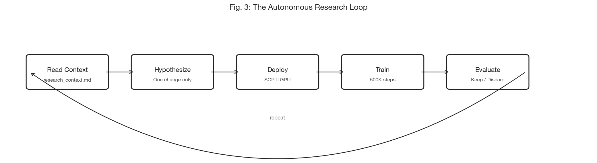
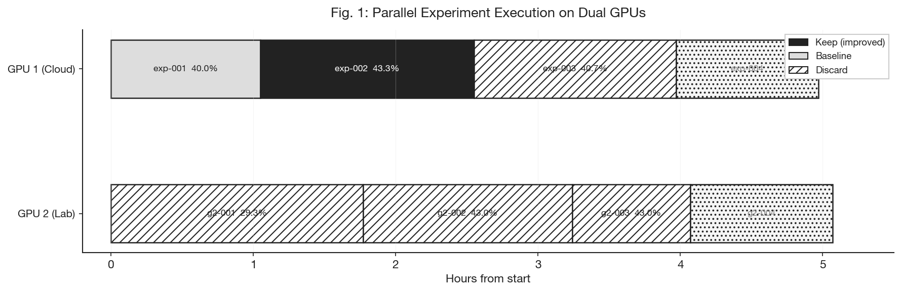
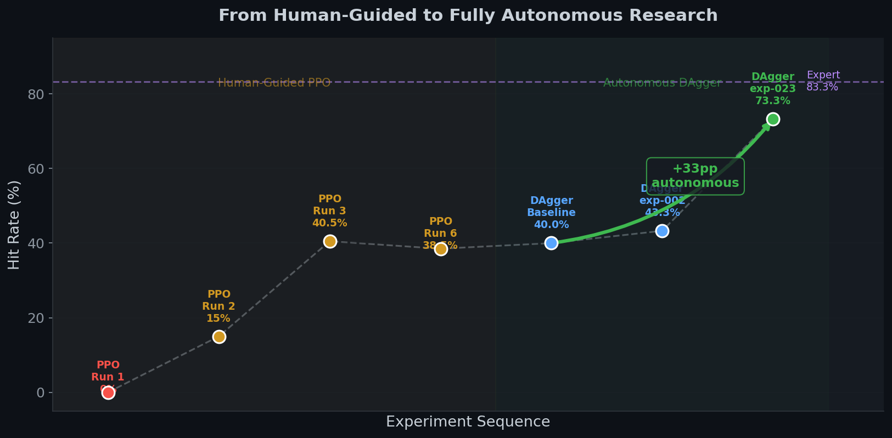

# LLM-Driven Autonomous Research for Flight Controller Optimization

A system for automated experiment design, execution, and evaluation using large language model agents. Applied to neural drone flight controller training, the system improved intercept performance from 40.0% to 73.3% without human intervention.

---

## Abstract

We describe an autonomous research system in which an LLM agent (Claude Code) iteratively designs, implements, deploys, trains, and evaluates machine learning experiments on remote GPU infrastructure. The system operates in a continuous loop: each iteration proposes a single modification, trains on a fixed compute budget, compares against the current best, and either merges the improvement or reverts the change. A persistent research context file accumulates findings across iterations, giving each new agent instance the full institutional memory of the research program.

Applied to a vision-based drone intercept task, the system executed experiments across two parallel GPUs and improved the deployed policy from a 40.0% baseline to **73.3% intercept rate** — a +33.3 percentage point gain achieved autonomously while the researcher focused on other work.

## Key Results

| Metric | Value |
|---|---|
| Baseline (human-established) | 40.0% |
| Best autonomous result | 73.3% |
| Expert ceiling | 83.3% |
| Autonomous improvement | +33.3 pp |
| Gap closed | 77% of baseline-to-expert gap |
| Parallel GPU utilization | 2 GPUs, ~6 experiments / 4 hours |

---

## System Architecture

### The Autonomous Loop

  

Each iteration executes a complete experimental cycle:

1. **Read context.** The agent loads `research_context.md` (accumulated findings from all prior experiments) and `experiment_history.tsv` (quantitative results). This provides institutional memory without requiring persistent agent state.

2. **Hypothesize.** Based on accumulated context, the agent identifies the most promising modification. A `CLAUDE.md` file provides hard constraints (immutable physics, domain randomization lower bounds, scenario parameters) and the search space. Exactly one change is implemented per iteration to isolate causal effects.

3. **Deploy.** Modified source files are transferred to a remote GPU server via SCP. The C physics simulator is rebuilt, and a 40-test verification suite runs to catch regressions before training.

4. **Train.** Training executes on the GPU with a fixed compute budget (500K PPO steps or 60 DAgger rounds). Fixed budgets ensure fair comparison across experiments and predictable throughput.

5. **Evaluate.** Metrics are extracted from TensorBoard event files on the remote server. The primary metric (hit rate on randomized evaluation) is compared against the current best.

6. **Keep or discard.** Binary decision. Improvement → merge into main branch. No improvement → revert all changes. The codebase can only improve (ratchet mechanism).

The loop then repeats indefinitely.

### Parallel Execution

  

A single orchestrator manages two independent GPU servers. Each runs a full experiment pipeline in its own git worktree, preventing code contamination between concurrent experiments. The orchestrator monitors training progress via SSH, detects stalls (10-minute inactivity threshold), and manages experiment lifecycle.

| Resource | Specification |
|---|---|
| GPU 1 | NVIDIA RTX 4000 Ada (20 GB), Hetzner cloud |
| GPU 2 | University lab server |
| Orchestrator | macOS (Apple Silicon) |
| Experiment duration | ~45 min (DAgger) or ~8 min (PPO) |
| Throughput | ~1.3/hour (DAgger) or ~7/hour (PPO) |

### Adaptive Research Strategy

The system adjusts its exploration strategy based on consecutive failure count:

| Failures | Mode | Behavior |
|---|---|---|
| 0–2 | Incremental | Small modifications building on current best |
| 3–4 | Pivot | Switch to a different search category |
| 5+ | Exploration | Search literature for novel techniques |

### Constraint Enforcement

Hard constraints prevent metric inflation:

- Physics constants (mass, inertia, thrust coefficients) are immutable
- Domain randomization ranges can only increase, not decrease
- Scenario parameters (target speed, distance, hit radius) are fixed
- Camera field-of-view limits are fixed

Any constraint violation triggers automatic rejection, regardless of reported performance.

---

## Results

### Research Progression

  

The project proceeded in two phases. In the human-guided phase, PPO training from scratch reached a ceiling at approximately 40% over 6 training runs spanning several weeks. After establishing a DAgger baseline at the same level, the autonomous system was engaged. The agent autonomously discovered several improvements that the researcher had not considered:

| Discovery | Impact | Cumulative | Mechanism |
|---|---|---|---|
| 2-layer LSTM architecture | +3.3 pp | 43.3% | Increased temporal modeling capacity |
| Dataset buffer sizing (maxlen 5→15) | +15.7 pp | 59.0% | More diverse training distribution |
| Staged LR decay (7e-5→1.4e-5) | +1.0 pp | 60.0% | Progressive refinement over 150 rounds |
| Loss weighting [15,15,0.1,1] + maxlen 20 | +5.7 pp | 65.7% | Emphasis on roll/pitch over yaw |
| 3-phase LR schedule + maxlen 25 | +7.6 pp | 73.3% | Full recipe: 200 rounds, 3-phase decay |

Equally valuable were the negative results, which prevented the researcher from pursuing dead ends:

| Attempted | Outcome | Lesson |
|---|---|---|
| Episode boundary splitting in BPTT | −10.7 pp | Disrupts temporal learning |
| Inter-layer LSTM dropout | −2.6 pp | Regularization harmful in this regime |
| Zero entropy coefficient | Premature convergence | Exploration required throughout training |
| Curriculum stage 4 (full difficulty) | Catastrophic forgetting | Difficulty transitions must be gradual |

---

## Design Principles

**Fixed compute budgets.** Every experiment receives identical compute, enabling fair comparison and predictable throughput. No "run it longer to see" — the fixed window enforces disciplined evaluation.

**Git as ratchet.** Only improvements are merged. The git history becomes a readable research journal where each commit message summarizes an experiment and its outcome.

**Persistent research memory.** Each agent writes findings to a shared context file. Subsequent agents read this context, enabling knowledge accumulation across stateless agent instances.

**Single-variable experiments.** One change per iteration. If performance improves, the cause is unambiguous. If it degrades, revert is clean.

**File-based communication.** The orchestrator writes `CLAUDE.md` (instructions, constraints, history). The agent writes `experiment_result.json` (metrics, description, learnings). No API integration required — agents read and write files.

---

## Practical Implications

The system does not replace the researcher. The researcher designed the simulation, chose the training approach, defined constraints, and validated the deployed model. What the system automates is the iterative cycle of hypothesis → implementation → training → evaluation that dominates experimental machine learning workflows.

The approach is effective when:
- A well-defined scalar metric exists (hit rate on randomized evaluation)
- Experiments are fast relative to the search space (~45 min per experiment)
- Hard constraints can be specified to prevent degenerate solutions
- The search space is bounded but too large for exhaustive exploration

---

## Related Work

- Ross, S., Gordon, G., & Bagnell, D. (2011). A Reduction of Imitation Learning and Structured Prediction to No-Regret Online Learning. *AISTATS*.
- Lu, C., et al. (2024). The AI Scientist: Towards Fully Automated Open-Ended Scientific Discovery. *Sakana AI*.
- Romera-Paredes, B., et al. (2024). Mathematical Discoveries from Program Search with Large Language Models. *Nature*.
- Karpathy, A. (2025). Autoresearch. Concept for fixed-budget autonomous experiment loops.

## Repository

This repository documents the autonomous research methodology. The flight controller and simulation environment are described in a [separate repository](https://github.com/J3ykob/rl-drone-flight-controller).

## License

MIT.
